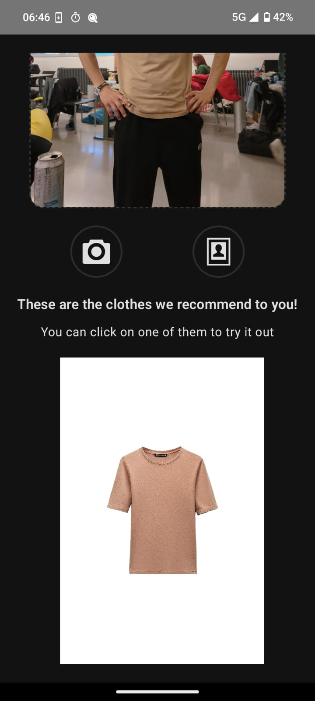

   

# Welcome to TryOn! 🚀

Welcome to our solution for the InditexTech challenge at HackUPC 2024. We are thrilled to introduce **TryOn!**, a mobile app that allows users to try on clothes similar to their chosen outfits using the provided Inditex product dataset. The main goal of the challenge was to find product similarities, and we've taken this a step further by matching user outfits with dataset products in a sleek and user-friendly app. Users can either take a photo or select one from their gallery, and TryOn! will find a set of similar items from the dataset. For more technical details, check out our [`backend-core`](https://github.com/HACKUPC-Try-on/backend) repository.

## Table of Contents
1. [App Features](#app-features)
   - [Explore Similar Products](#first-feature-explore-similar-products-🕵️‍♂️)
   - [Virtual Try-On](#second-feature-virtual-try-on-👗👔)
2. [Experiment with Our Backend](#beyond-clothes-experiment-with-our-backend-🧪)
3. [App Flow Diagram](#app-flow-diagram)
4. [Dataset Details](#dataset-details)

### App Features

#### First Feature: Explore Similar Products 🕵️‍♂️

Check out the screenshots below to get a glimpse of this first feature!

  
  
  

#### Second Feature: Virtual Try-On 👗👔

Finding clothes that look great is one thing, but integrating them into your style is another. That's why **TryOn!** allows users to virtually wear clothes recommended by similarity. Choose any item, and watch as it seamlessly replaces your current outfit. While it may seem like magic, the technology behind this feature is quite robust. Dive into our [`backend-tryon-inference`](https://github.com/HACKUPC-Try-on/backend-tryon-inference) repository to learn how it works.

Here are some of the results of our virtual try-on:

  
  
  

  
  
  

### Beyond Clothes: Experiment with Our Backend 🧪

Our system is designed around the Inditex dataset, but the fun doesn't stop with clothes! Visit our [backend](http://79.116.40.166:32490/docs#/default/create_tryon_try_on__post)) to try out materials or objects that aren't even clothes, leading to hilarious and funny results like this one using "Bananas" 🍌.

  
  
  

### App Flow Diagram

To summarize the app flow, think of the starting place as an empty canvas where the user can either take a picture with the phone camera or upload one from the gallery. Once that is done, TryOn! will show the user 5 similar clothing items from the catalog (which is a parametrizble number). That's it for similar clothing exploration.

As for the virtual try on, assuming the user has completed the stages above, having a picture on the app and the similar images are being shown, when one of the recomended items is chosen, a process of virtual try on will begin. The result is a modification of the original picture where the user is now wearing the selected item.

When this final stage is reached, new similar items are shown based on the item chosen to try on, and the process can continue on and on, providing an engaging experience where one can explore the catalog indefinitely.

Below is the diagram illustrating the flow of the application which helps to visualize how the components interact.

### Dataset preparation

The dataset used in this project was downloaded using a Python script. The script is available on GitHub as a gist. For those interested in how we obtained and prepared our data, you can view and download the [script](https://gist.github.com/FerranAD/a394c672453ecf1e81a4527648200ac3).
